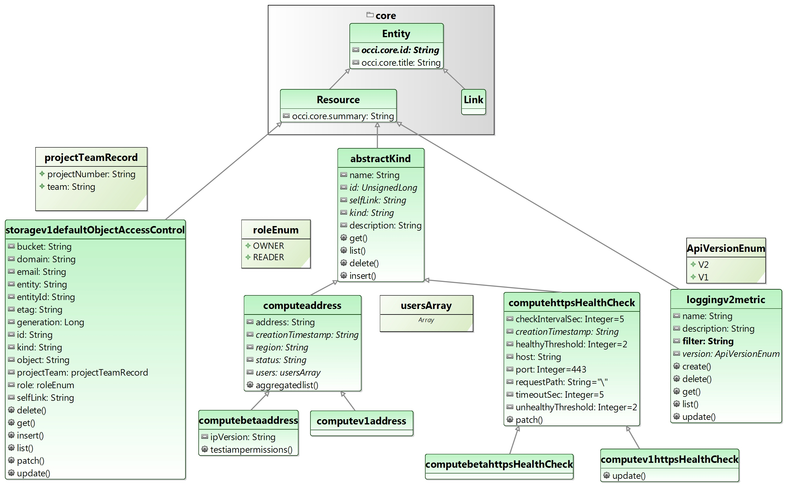

# A Precise Model for Google Cloud Platform 

Today, Google Cloud Platform (GCP) is one of the leaders among cloud APIs. Although it was established only five years ago, GCP has gained notable expansion due its suite of public cloud services that it based on a huge, solid infrastructure.
GCP allows developers to use these services by accessing GCP RESTful API that is described through HTML pages on its [website](https://cloud.google.com). However, the documentation of GCP API is written in English prose and therefore shows several drawbacks, such as _Informal Heterogeneous Documentation_, _Imprecise Types_, _Implicit Attribute Metadata_, _Hidden Links_, _Redundancy_ and _Lack of Visual Support_. To avoid confusion and misunderstandings, the cloud developers obviously need a precise specification of the knowledge and activities in GCP.
Therefore, this paper introduces **GCP Model**, an inferred formal model-driven specification of GCP which describes without ambiguity the resources offered by GCP. **GCP Model** is conform to the Open Cloud Computing Interface (OCCI) metamodel and is implemented based on the open source model-driven Eclipse-based **OCCIware** tool chain. Thanks to our **GCP Model**, we offer corrections to the drawbacks we identified. 
We also evaluate the uniformity, conciseness, consistency and comprehensiveness of GCP documentation and we deduce quantitative results that validate the preciseness of our model.



## Install

First download the project with:

```sh
git clone https://github.com/occiware/GCP-Model.git
```

Second, download Stanford parser [here](https://nlp.stanford.edu/software/stanford-parser-full-2018-10-17.zip).

Unzip the downloaded archive and put it in the following place: `GCP-Model/plugins/org.eclipse.cmf.occi.google/stanford-parser-full-2018-10-17/stanford-parser-full-2018-10-17/`

Finally, you will have to configure the constant `PATH_TO_ROOT_PROJECT` in `org.eclipse.cmf.occi.google.handlers.GoogleCrawler` to point to the folder that contains the project.